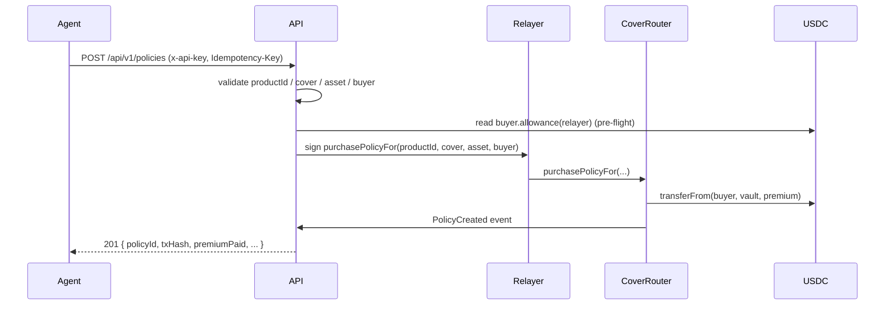

<Note>
  See [/concepts/lifecycle](/concepts/lifecycle) for the end-to-end flow (policy → trigger → bond → wait/sell decision).
</Note>

The agent's job is one HTTP call. Everything else — gas, on-chain encoding,
event scraping for the policyId — happens server-side.

## Sequence



## SDK (recommended)

```ts
const policy = await lumina.policies.purchase({
  productName: 'FLASHBTC24-001',               // SDK 0.3.0+ auto-resolves productId hash + asset='BTC'
  buyer: '0xYourWalletAddress',
  coverageAmount: '50000000',                  // $50 in 6-dec USDC
  idempotencyKey: crypto.randomUUID(),         // strongly recommended
})
```

You can still pass `productId` (bytes32 hash) or `asset` (symbol or bytes32)
explicitly — the SDK only auto-resolves when the field is omitted. See
[Products and assets](/agents/products-and-assets) for the full table of
expected asset literals per shield.

## curl

```bash
curl -X POST https://lumina-api-production-ac85.up.railway.app/api/v1/policies \
  -H "x-api-key: $LUMINA_API_KEY" \
  -H "Content-Type: application/json" \
  -H "Idempotency-Key: $(uuidgen)" \
  -d '{
    "productName":    "FLASHBTC24-001",
    "coverageAmount": "50000000",
    "buyer":          "0xYourWalletAddress"
  }'
```

## Field deep-dive

- **`productName`** — canonical name (`FLASHBTC24-001`, `MICRODEPEG-001`, …). Preferred input — the API resolves both the `productId` hash AND the per-shield `asset` literal from it. See [Products and assets](/agents/products-and-assets) for the registered set.
- **`productId`** — bytes32 hash. Optional alternative to `productName`. Compute as `keccak256(toUtf8Bytes('FLASHBTC24-001'))`. Pre-computed values are listed in [Shields](/concepts/shields).
- **`coverageAmount`** — string of USDC base units. $50 = `"50000000"`. Always pass as a string to preserve precision.
- **`asset`** — bytes32 of the asset symbol. **Optional** — the API auto-resolves the per-shield literal when omitted. This must equal the product's `coveredAsset` (now exposed on `GET /products`) — *not* the USDC payment token. Each shield expects a specific value (`BTC` for FlashBTC, `ETH` for FlashETH, `USDT` for MicroDepeg, `USDC` for RateShock); sending the wrong one reverts with `InvalidAsset(bytes32)` (selector `0x8196d462`). See [Covered asset vs payment asset](/concepts/assets) for the distinction.
- **`buyer`** — the wallet that pays the USDC premium (NOT the relayer). Must hold ≥ premium and have approved the relayer-side spender.

## Idempotency

Pass `Idempotency-Key: <uuidv4>` on every retryable purchase. Replays return
the original response without double-spending. The key is scoped per agent;
it's safe (and good practice) to derive a fresh UUID per logical attempt.

## Errors

| HTTP | Code | Retry? |
|---|---|---|
| 400 | `validation_error` | No |
| 401 | `invalid_api_key` | No |
| 422 | `shield_paused` | Maybe later |
| 422 | `exceeds_capacity` | Maybe later |
| 429 | `rate_limit` | Yes (backoff) |
| 5xx | `server_error` | Yes (≤3 attempts) |
