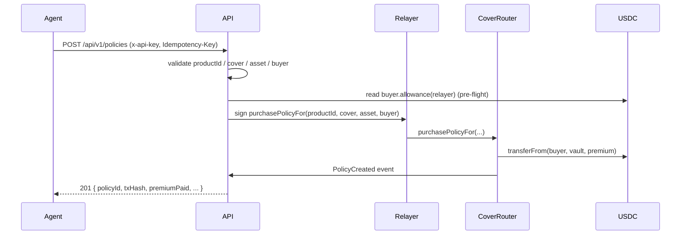

The agent's job is one HTTP call. Everything else — gas, on-chain encoding,
event scraping for the policyId — happens server-side.

## Sequence



## SDK

```ts
import { keccak256, toUtf8Bytes } from 'ethers'

const policy = await lumina.policies.purchase({
  productId: keccak256(toUtf8Bytes('FLASHBTC24-001')),
  buyer: '0xYourWalletAddress',
  coverageAmount: '50000000',                  // $50 in 6-dec USDC
  asset: 'USDC',                               // SDK encodes to bytes32 for you
  idempotencyKey: crypto.randomUUID(),         // strongly recommended
})
```

## curl

```bash
curl -X POST https://lumina-api-production-ac85.up.railway.app/api/v1/policies \
  -H "x-api-key: $LUMINA_API_KEY" \
  -H "Content-Type: application/json" \
  -H "Idempotency-Key: $(uuidgen)" \
  -d '{
    "productId":      "0xdc5bcc7d6e2e9ca89d46d4f6672db80985d5e86509243dcca44a4e87d871a7b9",
    "coverageAmount": "50000000",
    "asset":          "0x5553444300000000000000000000000000000000000000000000000000000000",
    "buyer":          "0xYourWalletAddress"
  }'
```

## Field deep-dive

- **`productId`** — bytes32 hash. Compute as `keccak256(toUtf8Bytes('FLASHBTC24-001'))`. Pre-computed values are listed in [Shields](/concepts/shields).
- **`coverageAmount`** — string of USDC base units. $50 = `"50000000"`. Always pass as a string to preserve precision.
- **`asset`** — bytes32 of the asset symbol. `ethers.encodeBytes32String('USDC')` = `0x5553444300…0000`. The SDK accepts the symbol `'USDC'` and encodes for you.
- **`buyer`** — the wallet that pays the USDC premium (NOT the relayer). Must hold ≥ premium and have approved the relayer-side spender.

## Idempotency

Pass `Idempotency-Key: <uuidv4>` on every retryable purchase. Replays return
the original response without double-spending. The key is scoped per agent;
it's safe (and good practice) to derive a fresh UUID per logical attempt.

## Errors

| HTTP | Code | Retry? |
|---|---|---|
| 400 | `validation_error` | No |
| 401 | `invalid_api_key` | No |
| 422 | `shield_paused` | Maybe later |
| 422 | `exceeds_capacity` | Maybe later |
| 429 | `rate_limit` | Yes (backoff) |
| 5xx | `server_error` | Yes (≤3 attempts) |
