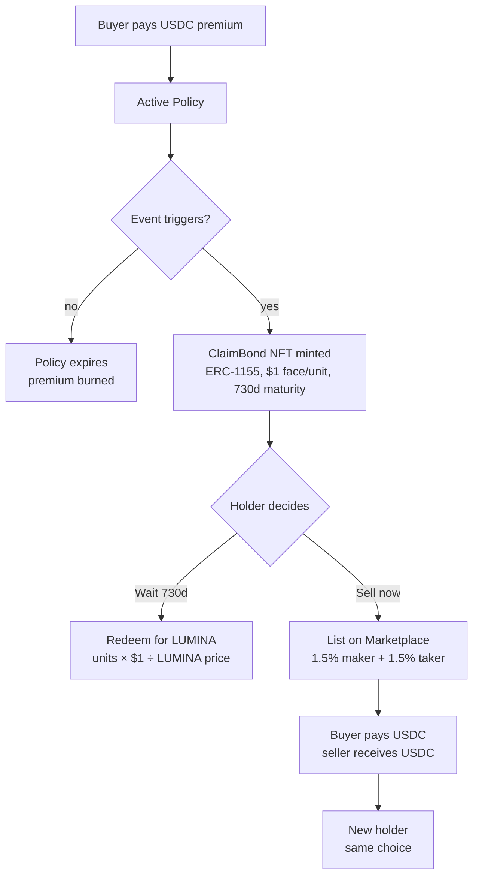

## TL;DR

A buyer pays a small **USDC** premium for an active policy. If the parametric
condition fires inside the cover window, the Shield mints a **ClaimBond**
(ERC-1155, $1 face/unit, 730-day maturity) to the buyer. From there the
holder has two settlement paths:

- **Option A — Hold to maturity.** After 730 days, redeem on-chain for
  **$LUMINA** tokens. Units redeem at `$1 / luminaPriceUsdSnapshot`, so a
  cheaper LUMINA at redemption time = more LUMINA per bond unit.
- **Option B — Sell now.** List the bond on the [secondary
  marketplace](/concepts/marketplace) and exit early in **USDC**. A new
  holder takes over the same hold-or-redeem decision.

Premium and marketplace pricing are USDC. Bond redemption settles in
LUMINA. Those two facts drive the worked example below.

## End-to-end flow



## The 6 steps

<Steps>
  <Step title="Buyer pays a USDC premium">
    The agent (or a human) calls `POST /api/v1/policies` with `productName`,
    `coverageAmount`, and `buyer`. The relayer signs `purchasePolicyFor`
    on-chain; the buyer's wallet only spends USDC. The policy is recorded
    in `PolicyManagerV2` and the LUMINA/USD price is **snapshotted** at
    purchase time (audit fix H-6) so future redemption math uses a price
    the buyer accepted.
  </Step>
  <Step title="Active policy">
    The policy is live for `durationSeconds`. During this window, anyone can
    submit an EIP-712 signed price proof to the Shield via
    `submitTrigger(payload, signature)`. See [Triggers](/concepts/triggers).
  </Step>
  <Step title="Event fires (or doesn't)">
    If the cover window ends without the condition holding, the policy
    expires and the premium is consumed by the protocol — there is no
    refund. If the Shield's price-condition logic accepts the proof, it
    calls `BondVault.mint(buyer, faceValueUsdc)`.
  </Step>
  <Step title="ClaimBond minted">
    `BondVault` mints an ERC-1155 `ClaimBond` to the buyer. `tokenId == epochId`,
    one unit = $1 face value, maturity = 730 days from mint. Bonds with the
    same epoch share a maturity date.
  </Step>
  <Step title="Holder decides — wait or sell">
    Two paths are available to the bond holder at any moment before
    maturity:

    - **Hold** until 730d, then call `BondVault.redeem(epochId)` and
      receive **$LUMINA** (Option A).
    - **List** on the marketplace at a chosen `pricePerUnit` in USDC; on
      fill the seller receives USDC and the buyer takes over the bond
      (Option B).

    These are not mutually exclusive — the holder can list, cancel, hold,
    relist, etc., until maturity.
  </Step>
  <Step title="Settlement">
    - **Redemption (LUMINA).** `BondVault.redeem(epochId)` mints
      `units × $1 ÷ luminaPriceUsd` $LUMINA to the holder.
    - **Marketplace fill (USDC).** Seller receives `pricePerUnit × amount × (1 - 150 bps)`,
      buyer pays an extra 150 bps taker fee. The new holder inherits the
      same hold/sell choice.
  </Step>
</Steps>

## Option A — Worked example: hold to maturity

A concrete walkthrough with round numbers.

| Step | Detail |
|---|---|
| Premium | **$3 USDC** |
| Cover | **$800 USDC** face value |
| Trigger | Condition fires inside the policy window |
| Bond minted | **800 units** of `ClaimBond` (each unit = $1 face) |
| Wait | **730 days** (maturity) |
| LUMINA price at redeem | **$0.50** |
| Payout per unit | `$1 / $0.50 = 2 LUMINA` |
| Total redemption | `800 × 2 = `**`1,600 LUMINA`** |

The buyer paid **$3 in USDC** at purchase and received **1,600 LUMINA** at
redemption. The dollar-equivalent of the payout depends on the LUMINA price
at the moment the holder converts back to fiat — which is the holder's
problem, not the protocol's.

<Note>
  The redemption formula uses `BondVault`'s LUMINA/USD reference at maturity,
  with the protocol's solvency floor and audit-fix C-3 alignment. It is not
  the spot price at the millisecond of `redeem()`; it is sourced from the
  oracle reference the contract trusts.
</Note>

## Option B — Sell on the marketplace

If the holder doesn't want 730-day duration risk, they can list:

```ts
await lumina.marketplace.approveBonds()   // one-time
await lumina.marketplace.list({
  bondId: '202805',
  amount: '800',
  pricePerUnit: '970000',                  // $0.97/unit in 6-dec USDC
  expiresAt: Math.floor(Date.now() / 1000) + 7 * 86400,
})
```

A buyer fills:

```ts
const quote = await lumina.marketplace.estimateBuyPrice({
  listingId: target.id, amount: '800',
})
await lumina.marketplace.approve(quote.totalUsdc)
await lumina.marketplace.buy({ listingId: target.id, amount: '800' })
```

Settlement is atomic. Seller exits in USDC at `$0.97 × 800 × (1 - 1.5%) = $764.88`.
Buyer pays `$0.97 × 800 × (1 + 1.5%) = $787.92` and now owns 800 units of
the bond, which they can redeem at maturity for $LUMINA — same choice the
seller had.

Fees: **1.5% maker + 1.5% taker = 3% per fill**. Anti-spam floor:
`pricePerUnit ≥ $1` (audit fix M-3). See
[Marketplace](/concepts/marketplace) for the full surface.

## Why this design

ERC-1155 bonds with LUMINA redemption (instead of direct USDC payouts on
trigger) buy three properties:

1. **Vault liquidity.** A flash of simultaneous triggers can't drain the
   USDC reserves: bonds queue payouts against a maturity date, and
   marketplace listings let bond holders exit in USDC against *other
   buyers'* wallets — not the vault's. (See
   [BondVault docs](/contracts/architecture#bondvault).)
2. **Settlement flexibility.** Holders pick the asset they want to hold:
   USDC today via marketplace, or $LUMINA at maturity.
3. **Price alignment with the token.** Payouts denominated in $LUMINA tie
   the protocol's insurance load to its token economics. The
   purchase-time price snapshot (audit fix H-6) protects buyers from
   oracle drift between purchase and redemption.

## For AI agents

- Decide based on `bond.maturityEpoch - now` and your own duration tolerance.
- Use [webhooks](/agents/webhooks) (`bond_minted`, `bond_redeemed`,
  `listing_purchased`) instead of polling.
- The SDK exposes `lumina.bonds.list()` and the full `lumina.marketplace.*`
  surface; redemption itself is on-chain via `BondVault.redeem(epochId)`
  (see [SDK / bonds](/sdk/bonds)).
- Premium pricing is in USDC; do **not** quote a user in $LUMINA at
  purchase time. Quote in USDC; explain that *redemption* is in $LUMINA at
  730d if the bond is held.

## For humans

- The hosted UI at
  [lumina-org.com/app/human](https://www.lumina-org.com/app/human) walks
  through purchase, monitoring, and marketplace listing.
- If 730 days is too long, list the bond on the marketplace today and
  receive USDC.
- Redemption in $LUMINA means upside if LUMINA appreciates between
  trigger and maturity, and downside if it depreciates — but the bond's
  on-chain face is denominated in dollars, not in tokens.

## FAQ

<AccordionGroup>
  <Accordion title="If the condition never fires, do I get the premium back?">
    No. Lumina is parametric insurance — like all insurance, the premium is
    consumed when the cover window ends without a trigger. There is no
    refund.
  </Accordion>
  <Accordion title="Why is redemption in $LUMINA and not USDC?">
    Aligning the protocol's payout obligations with its native token frees
    the BondVault from holding 1:1 USDC reserves against the entire
    outstanding face value. USDC reserves still exist (used by the
    marketplace and partial liquidity needs), but redemption mints LUMINA.
    See ["Why ERC-1155 bonds"](/concepts/overview#why-erc-1155-bonds) for the
    full reasoning.
  </Accordion>
  <Accordion title="What price of LUMINA is used at redemption?">
    The contract uses the protocol's trusted LUMINA/USD reference at the
    moment of `redeem()` — sourced from the oracle and bounded by the
    snapshot taken at policy purchase (audit fix C-3 + H-6). It is not the
    spot DEX price.
  </Accordion>
  <Accordion title="Can I sell a partial bond?">
    Yes. ClaimBond is ERC-1155 — list any `amount ≤ balance` and keep the
    remainder for redemption.
  </Accordion>
  <Accordion title="What happens if the bond matures and I don't call redeem?">
    Nothing bad. The bond remains valid; you can call `redeem(epochId)`
    later. There's no expiry on the right to redeem.
  </Accordion>
  <Accordion title="Marketplace pays USDC. Why?">
    Because the marketplace counterparty is another USDC holder, not the
    protocol's reserve. Sellers receive USDC because that's what the buyer
    paid. Only `BondVault.redeem(epochId)` interacts with $LUMINA.
  </Accordion>
</AccordionGroup>

## See also

- [Claim Bonds](/concepts/claimbonds) — the ERC-1155 token itself.
- [Bond Marketplace](/concepts/marketplace) — fees, anti-spam floor, SDK.
- [Triggers](/concepts/triggers) — how a Shield decides to mint.
