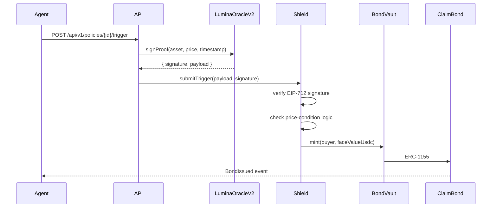

<Note>
  See [/concepts/lifecycle](/concepts/lifecycle) for the end-to-end flow (policy → trigger → bond → wait/sell decision).
</Note>

When a Lumina policy's condition fires (e.g. BTC dropped 20% in the last hour),
the on-chain payout flow is fully deterministic. Here's the sequence end-to-end.

## Sequence diagram



## What's signed (EIP-712)

```
struct PriceProof {
  bytes32 asset;            // keccak256("BTC"), etc.
  uint256 price;            // 18 decimals
  uint256 timestamp;        // unix seconds; ≤ MAX_PROOF_AGE old
  uint256 nonce;            // per-asset replay counter
}
```

The Shield verifies:

1. The signature recovers to `LuminaOracleV2.oracleKey()` (the only allowed
   signer).
2. `block.timestamp - payload.timestamp ≤ MAX_PROOF_AGE` (24 hours after
   audit fix M-8).
3. The nonce is strictly greater than the last accepted nonce for the asset
   (replay protection).
4. The asset/price meets the Shield's specific condition.

## Who can submit a trigger

Anyone. The signature is what gives the trigger weight, not the submitter. In
practice:

- An agent can submit their own trigger if they're watching the price feed.
- A keeper bot can submit triggers en masse for efficiency.
- The Lumina API exposes `POST /api/v1/policies/{id}/trigger` as a convenience
  wrapper — internally it asks the oracle for a fresh proof and submits.

## Why off-chain signing (vs. fully on-chain Chainlink)

Two reasons:

1. **Latency.** A flash crash needs to be triggered within minutes; a Chainlink
   round refresh on Base Sepolia is ~hourly.
2. **Cost.** Pulling a Chainlink price into a Shield's storage on every
   trigger would inflate gas significantly. EIP-712 proofs are 65 bytes of
   calldata.

Chainlink-compatible feeds *are* used as the upstream price source by the
oracle (see `BTC_PRICE_FEED` / `ETH_PRICE_FEED` in `/health`); the oracle
just signs the value before passing it to the Shield.
